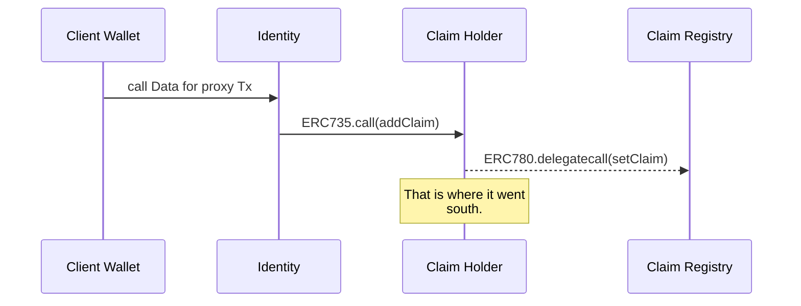

# claim.it Contracts

Hello ! This repository is dedicated to the Solidity contracts for claim.it platform. In this repository you will find two sub directory one for a simplified ENS deployment and one for revamped claims standard (Claim Holder and Claim Registry).

Here is a small graph of the flow to add a claim:

# Design Choices

When designing our smart contracts architecture we took a few design assumption.

## Claim Registry

To us the Claim Registry would make sense if, like ENS, there would be a single contract to keep a registry of all claimed set on the network. Thanks to that accessing any claim data and making claim filters would be simpler. 

## Arborescent Claims

By designing claims to have a given parent ID paired with an *isValid* parameter, it is possible to link claims between each other. We thought that to check if a claim is valid, it was needed for all the parent from the claim to the *root* claim to be valid. By default a claim is considered valid .

